# Carnet CRED

Carnet digital de crecimiento, desarrollo, vacunación y anemia para niñas y niños asegurados en EsSalud. Los digitadores registran lo que se hizo en cada atención y las madres, padres y apoderados lo ven al momento desde su celular, con una interfaz pensada para que acompañar el crecimiento del niño sea sencillo y agradable.

---

## 1. Objetivo del MVP

El MVP valida una sola hipótesis: **si el digitador registra la atención el mismo día, la familia consulta el carnet digital y llega a tiempo a sus vacunas y controles.**

**Criterios de éxito**
- Un establecimiento donde los digitadores registran todas las atenciones CRED, de vacunación y de anemia de un mes.
- Al menos el 60 % de los apoderados vinculados abre el carnet en ese mes.
- Cero datos clínicos modificados sin rastro en la auditoría.
- Cero apoderados que vean a un niño con el que no tienen vínculo.

---

## 2. Alcance

### Incluido en el MVP
- Tres roles: **admin**, **digitador** y **usuario** (apoderado).
- Registro del niño, de sus datos de nacimiento y de sus apoderados.
- Vinculación del apoderado con el niño hecha por el digitador, con un código de activación.
- Vacunación: dosis aplicadas, dosis pendientes y dosis vencidas, calculadas contra el esquema vigente.
- Controles CRED: peso, talla y perímetro cefálico, con puntaje Z y clasificación según las tablas de la OMS.
- Anemia: dosajes de hemoglobina con ajuste por altitud, clasificación y entregas de hierro.
- Citas: próximo control CRED, próxima vacuna y próximo dosaje.
- Interfaz del usuario animada y en modo de solo lectura (sección 5).
- Carnet descargable en PDF.
- Notificaciones de citas y dosis pendientes por correo y por notificaciones push del navegador (PWA).
- Auditoría de todo registro y toda corrección.
- Reportes epidemiológicos y tableros por red asistencial.

---

## 3. Stack tecnológico

| Capa | Tecnología | Notas |
|---|---|---|
| Frontend web | **Next.js 16** + React 19 + TypeScript + Tailwind 4 + **Framer Motion** | Una sola web con tres áreas por rol; la del usuario es una PWA mobile-first |
| Gráficos | Visx (D3) | Curvas de crecimiento y de hemoglobina animadas |
| Backend | **NestJS 12** + TypeScript (adaptador **Fastify**) | Monolito modular |
| Base de datos | **PostgreSQL 16** + **Prisma 7** | Fuente de verdad, migraciones versionadas |
| Caché y colas | **Redis** + BullMQ | Rate limiting, recordatorios, PDF y notificaciones |
| PDF | Plantilla HTML impresa con Chromium en el worker | El carnet se genera bajo demanda y no se guarda |
| Monorepo | pnpm 11 + Turborepo | Tipos y reglas clínicas compartidos entre web y API |
| Contenedores | **Docker** + Docker Compose | Mismo entorno en local y producción |
| CI | **GitHub Actions** | Lint, typecheck, pruebas y build |
| Servidor | VPS propio con **nginx** del host | El stack publica un solo puerto en `127.0.0.1` |
| Borde | Cloudflare (DNS, CDN, WAF, SSL en modo Full) | Sobre el dominio propio |

Runtime: Node.js 24 LTS.

---

## 4. Arquitectura

```
              Cloudflare (DNS / CDN / WAF, SSL Full)
                              │
                 nginx del host (TLS propio)
                              │
                  127.0.0.1:<puerto> → Next.js (web)
                              │  route handlers del mismo origen
                              ▼
                     NestJS (API REST, red interna)
                              │
                     ┌────────┴────────┐
                PostgreSQL           Redis
                                       │
                                 worker BullMQ
                 (recordatorios, notificaciones, PDF)
```

**El navegador nunca llama a la API directamente.** La web habla con la API por la red interna de Docker. La sesión vive en una cookie `httpOnly` y nunca llega al JavaScript del cliente.
### Módulos del backend

| Módulo | Responsabilidad |
|---|---|
| `identity` | Cuentas, sesiones, roles, activación del usuario, recuperación de contraseña |
| `facilities` | Establecimientos (Centros Asistenciales) y asignación de digitadores |
| `children` | Niño, datos de nacimiento, apoderados y vínculos |
| `catalogs` | Esquema de vacunación por versiones, tablas OMS, umbrales de hemoglobina y ajuste por altitud |
| `immunization` | Dosis aplicadas y cálculo de dosis pendientes y vencidas |
| `growth` | Controles CRED, puntaje Z y clasificación nutricional |
| `anemia` | Dosajes de hemoglobina, clasificación y suplementación con hierro |
| `schedule` | Citas y recordatorios |
| `notifications` | Cola de mensajes salientes (correo y push) |
| `reports` | Carnet en PDF |
| `audit` | Registro inmutable de eventos |

**Reglas de convivencia**
- Un módulo no lee las tablas de otro; solo usa su interfaz pública.
- Las reglas clínicas (puntaje Z, ajuste de hemoglobina, dosis pendientes) viven en un paquete compartido y puro, sin acceso a la base, para probarlas aisladas y mostrar la misma clasificación en la web y en el PDF.
- Las notificaciones salen por cola, nunca dentro de la petición.

---

## 5. Roles

| Rol | Alcance | Cómo se obtiene |
|---|---|---|
| Admin | Global | El primero se crea por consola; los demás los crea otro admin |
| Digitador | Por establecimiento | Lo crea un admin y lo asigna a uno o más establecimientos |
| Usuario | Por niño vinculado | Se activa con el código que le entrega el digitador |

Los permisos por establecimiento y por niño se guardan en la base de datos y se verifican en cada petición. No viajan en la sesión.

### Admin
- Crea, suspende y reasigna digitadores y admins.
- Administra los establecimientos, con su altitud (necesaria para ajustar la hemoglobina).
- Mantiene los catálogos: versiones del esquema de vacunación, umbrales de hemoglobina, intervalos de citas.
- Consulta la auditoría completa y revoca vínculos de apoderados.
- **No registra datos clínicos.** Si un admin necesita registrar, se le crea además una cuenta de digitador.

### Digitador
- Busca niños por DNI o CNV en todo el sistema, porque un niño puede atenderse en más de un establecimiento.
- Registra al niño y sus datos de nacimiento si aún no existen.
- Registra apoderados, los vincula con el niño y genera el código de activación.
- Registra vacunas, controles CRED, dosajes de hemoglobina, entregas de hierro y citas. Cada registro queda a nombre del establecimiento en el que está trabajando.
- Corrige sus propios registros dentro de las 72 horas indicando el motivo. Pasado ese plazo, o si el registro es de otro digitador, la corrección queda pendiente hasta que la apruebe un admin.
- Su pantalla está pensada para cargar rápido: formularios de una columna, uso completo con teclado, autocompletado de lote y vacuna, y validación al momento de rangos imposibles (por ejemplo, un peso que cambia más del 30 % respecto al control anterior pide confirmación).

### Usuario (apoderado)
Solo lectura. No modifica ningún dato clínico. Su interfaz es la más trabajada visualmente:

- **Inicio por niño:** tarjeta con foto opcional (la sube el propio usuario y solo la ve él), edad en meses y días, y un anillo de progreso del esquema de vacunación.
- **Línea de tiempo:** todas las atenciones en orden, con transiciones al desplazarse y un filtro por tipo.
- **Pasaporte de vacunas:** cada dosis es un sello que aparece con animación al aplicarse; las pendientes se ven como espacios vacíos con su fecha recomendada, y las vencidas resaltadas.
- **Curvas de crecimiento:** peso, talla y perímetro cefálico sobre las bandas de la OMS, dibujadas con animación. Al tocar un punto se ven la fecha, el valor y la clasificación en lenguaje sencillo.
- **Hemoglobina:** gráfico de los dosajes con la franja normal y el estado del tratamiento con hierro.
- **Próximo paso:** una sola tarjeta destacada con lo siguiente que toca (cita, vacuna o dosaje) y un botón para agregarlo al calendario del celular.
- **Logros:** hitos que celebran cumplir con el esquema a tiempo (por ejemplo, "esquema del primer año completo"), con una animación breve. Nunca se muestran como fallas los controles perdidos.
- Varios hijos en la misma cuenta, cambiando de uno a otro deslizando.
- Descarga del carnet en PDF.
- Respeta `prefers-reduced-motion`: con esa preferencia activa, las animaciones se reemplazan por cambios sin movimiento.
- Sin emojis en la interfaz; iconos e ilustraciones propias.

---

## 6. Reglas del dominio

### Niño y apoderados
- El niño se identifica por DNI o, si aún no lo tiene, por el CNV. Al obtener el DNI se agrega sin perder el historial.
- Un niño puede tener varios apoderados y un apoderado varios niños.
- **El vínculo lo crea solo el digitador**, con el apoderado presente y su DNI. El sistema genera un código de activación de 8 caracteres que vence en 7 días y se usa una sola vez.
- Un usuario nunca puede vincularse a un niño por su cuenta ni buscar niños.
- Si un vínculo se revoca (por ejemplo, por orden judicial), el acceso se corta al instante y queda en la auditoría.

### Vacunación
- El esquema es un catálogo **versionado**: cada versión tiene fecha de vigencia y define vacunas, dosis, edad recomendada y edad máxima. La versión inicial se toma de la norma técnica vigente del esquema nacional de vacunación.
- Cada dosis aplicada guarda vacuna, número de dosis, fecha, lote, establecimiento y quien la registró.
- Las dosis pendientes y vencidas se calculan a partir de la fecha de nacimiento y la versión del esquema que corresponde a esa fecha. No se guardan.

### Crecimiento
- Cada control guarda fecha, peso, talla o longitud, perímetro cefálico y si el niño se midió acostado o de pie.
- El puntaje Z (peso para la edad, talla para la edad, peso para la talla y perímetro cefálico) se calcula con las tablas de la OMS (método LMS) y se guarda junto al control con la versión de la tabla usada.
- En los prematuros se usa la edad corregida hasta los 24 meses.

### Anemia
- Cada dosaje guarda el valor observado, la altitud del establecimiento, el valor ajustado y la clasificación. Se conservan los tres porque el umbral puede cambiar.
- Los umbrales y el ajuste por altitud salen de la norma técnica de anemia vigente y viven en el catálogo, no en el código.
- Cada entrega de hierro guarda producto, presentación, dosis indicada, cantidad entregada y si es preventiva o tratamiento.

### Citas y recordatorios
- El digitador registra la próxima cita al cerrar cada atención; si no lo hace, el sistema propone una según los intervalos del catálogo.
- El worker envía avisos 3 días antes y el mismo día, y avisa una vez cuando una dosis pasa a vencida.

### Correcciones
- Los registros clínicos nunca se borran ni se sobrescriben. Una corrección crea una versión nueva que apunta a la anterior, con motivo y autor.
- El usuario ve siempre la versión vigente. La auditoría conserva todas.

---

## 7. Garantías de integridad

- Ningún usuario lee un dato de un niño sin un vínculo activo: la verificación se hace en la consulta, no solo en la interfaz.
- Las restricciones de unicidad (DNI y CNV del niño, dosis por niño y vacuna) viven en la base, no solo en el código.
- El catálogo vigente al momento del registro queda referenciado en el registro; cambiar el esquema no reescribe el historial.
- Los cálculos clínicos tienen pruebas con casos tomados de las tablas oficiales.

---

## 8. Estructura del repositorio

```
carnet-cred/
├── apps/
│   ├── web/          Next.js: áreas admin, digitador y usuario (PWA)
│   ├── api/          NestJS
│   └── worker/       BullMQ: recordatorios, notificaciones y PDF
├── packages/
│   ├── clinical/     Reglas clínicas puras (puntaje Z, hemoglobina, esquema)
│   └── contracts/    Tipos compartidos entre web y API
├── infra/            nginx, scripts de respaldo
├── docker-compose.yml
└── docker-compose.dev.yml
```

---

## 9. Diagramas

Los diagramas van de lo general a lo técnico: los casos de uso sirven para cualquier interesado; los de clases, datos, secuencia y despliegue son para el equipo técnico.

- [9.1 Actores](#91-actores)
- [9.2 Casos de uso](#92-casos-de-uso)
- [9.3 Fichas de casos de uso](#93-fichas-de-casos-de-uso)
- [9.4 Estados](#94-estados)
- [9.5 Diagrama de clases](#95-diagrama-de-clases)
- [9.6 Diagrama entidad-relación](#96-diagrama-entidad-relación)
- [9.7 Diagramas de secuencia](#97-diagramas-de-secuencia)
- [9.8 Diagrama de despliegue](#98-diagrama-de-despliegue)

### 9.1 Actores

| Actor | Quién es | Qué hace en el sistema |
|---|---|---|
| **Admin** | Personal de gestión del proyecto o de la red asistencial | Administra cuentas, establecimientos y catálogos; aprueba correcciones; revisa auditoría y reportes. **No registra datos clínicos.** |
| **Digitador** | Personal de EsSalud que registra las atenciones | Registra niños, apoderados, vacunas, controles, hemoglobina, hierro y citas. |
| **Usuario (apoderado)** | Madre, padre o apoderado del niño | Consulta el carnet de sus hijos. **Solo lectura.** |
| **Sistema (reloj)** | Tareas automáticas programadas | Envía recordatorios de citas y avisos de vacunas vencidas. |

### 9.2 Casos de uso

**Cómo leer los diagramas de casos de uso**
- Los rectángulos de color son **actores** (personas o el reloj del sistema).
- Los óvalos son **casos de uso**: lo que el actor logra con el sistema.
- `«incluye»`: el caso siempre ejecuta al otro (por ejemplo, registrar un dosaje siempre ajusta la hemoglobina por altitud).
- `«extiende»`: el caso se ejecuta solo en ciertas situaciones (por ejemplo, registrar al niño solo si la búsqueda no lo encontró).

#### 9.2.1 Vista general

Cada actor tiene su propia área. El usuario solo ve; el digitador registra; el admin administra.

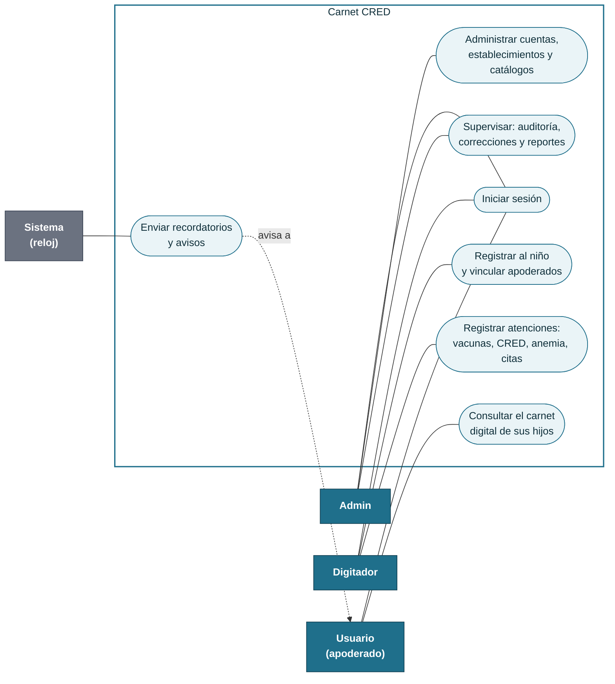

#### 9.2.2 Admin

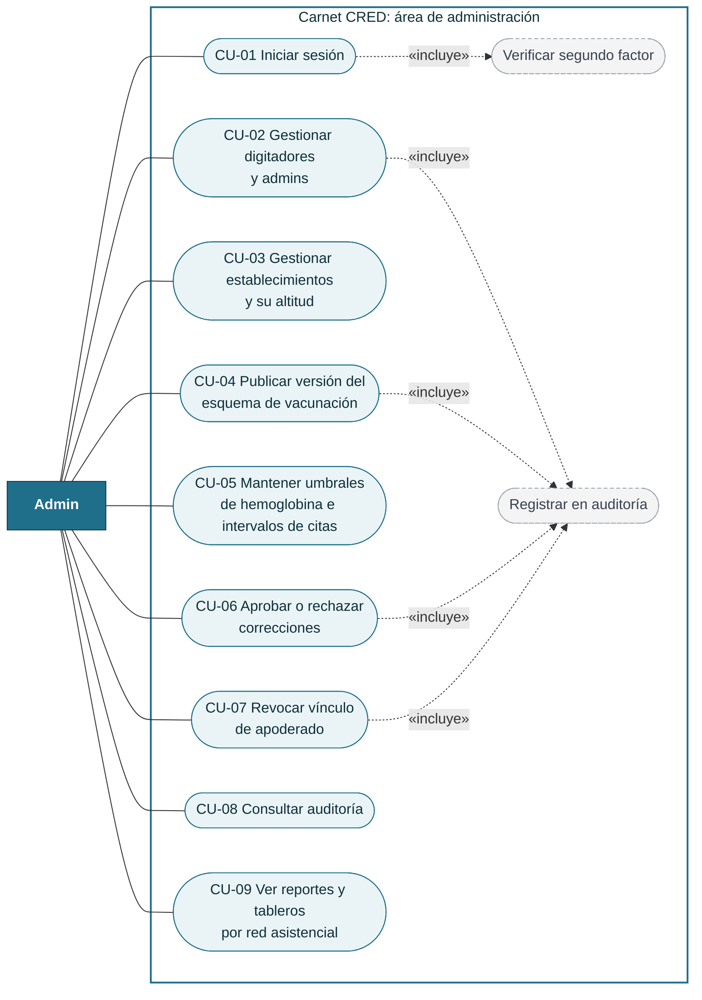

#### 9.2.3 Digitador

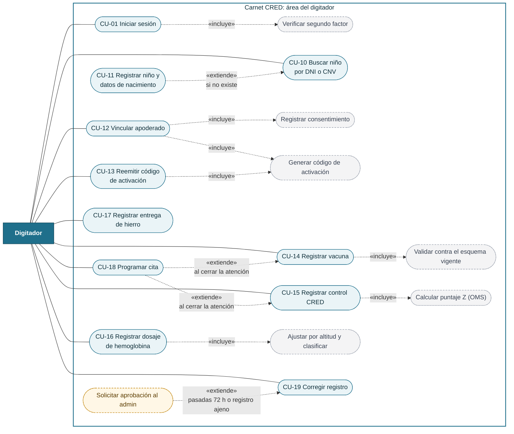

#### 9.2.4 Usuario (apoderado)

Todo lo que hace el usuario es de **lectura**. Las únicas acciones que guardan algo son activar su cuenta, sus preferencias de avisos y la foto opcional del niño, que solo ve él.

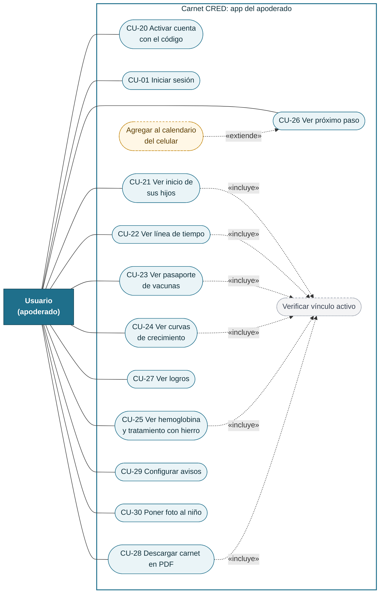

#### 9.2.5 Sistema (tareas automáticas)

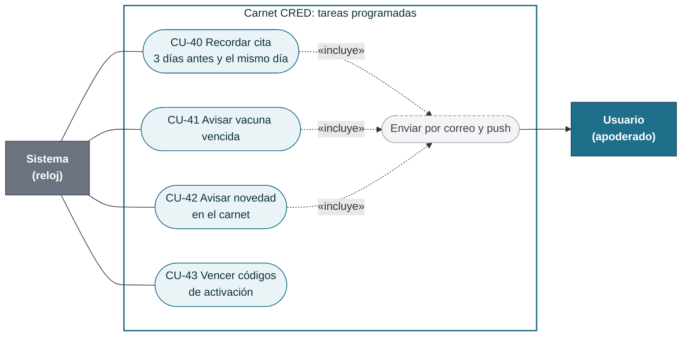

#### 9.2.6 Recorrido completo de una familia

Así se ve el sistema desde el día en que la familia llega al establecimiento hasta que recibe su primer recordatorio. Colores: azul = digitador, verde = apoderado, violeta = sistema automático.

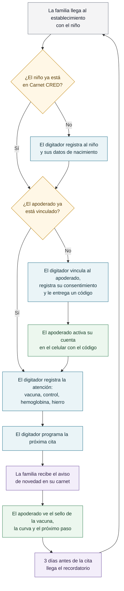

### 9.3 Fichas de casos de uso

Las fichas describen paso a paso los casos más importantes. Los que no tienen ficha son consultas o mantenimientos simples.

Cada ficha trae su diagrama de actividad. Los colores indican quién hace cada paso:

| Color | Significado |
|---|---|
| Azul | Digitador |
| Verde | Apoderado |
| Naranja | Admin |
| Violeta | Sistema |
| Amarillo | Decisión |
| Rojo | Flujo alternativo o excepción (el código, como `2a`, remite al texto) |

#### CU-12 Vincular apoderado

| | |
|---|---|
| **Actor** | Digitador |
| **Objetivo** | Que un apoderado pueda ver el carnet digital de un niño. |
| **Precondiciones** | El digitador inició sesión y el niño está registrado. El apoderado está presente con su DNI. |
| **Disparador** | El apoderado pide acceso al carnet digital durante una atención. |

**Diagrama de actividad**

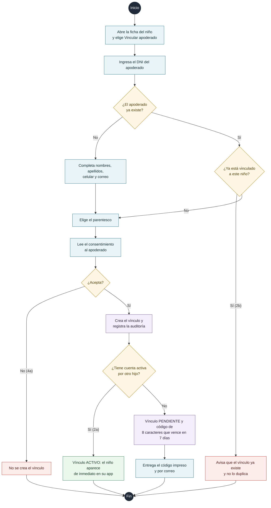

**Flujo principal**
1. El digitador abre la ficha del niño y elige "Vincular apoderado".
2. Ingresa el DNI del apoderado. Si ya existe, el sistema muestra sus datos; si no, el digitador completa nombres, apellidos, celular y correo.
3. Elige el parentesco (madre, padre, otro apoderado).
4. Lee al apoderado el texto de consentimiento y marca que lo aceptó.
5. El sistema crea el vínculo y genera un código de activación de 8 caracteres.
6. El digitador entrega el código impreso o lo dicta. El sistema también lo envía al correo del apoderado si lo tiene.

**Flujos alternativos**
- **2a.** El apoderado ya tiene cuenta activa por otro hijo: no se genera código; el niño aparece de inmediato en su app.
- **2b.** El apoderado ya está vinculado a este niño: el sistema avisa y no duplica el vínculo.
- **4a.** El apoderado no acepta el consentimiento: no se crea el vínculo.

**Postcondiciones:** el vínculo queda en estado *pendiente de activación* (o *activo* en 2a), y la acción queda en la auditoría.

**Reglas**
- Solo un digitador puede crear vínculos. El usuario nunca puede vincularse solo.
- El código vence a los 7 días y sirve una sola vez.

#### CU-20 Activar cuenta con el código

| | |
|---|---|
| **Actor** | Usuario (apoderado) |
| **Objetivo** | Crear su cuenta y ver por primera vez el carnet de su hijo. |
| **Precondiciones** | Tiene un código vigente entregado por el digitador. |

**Diagrama de actividad**

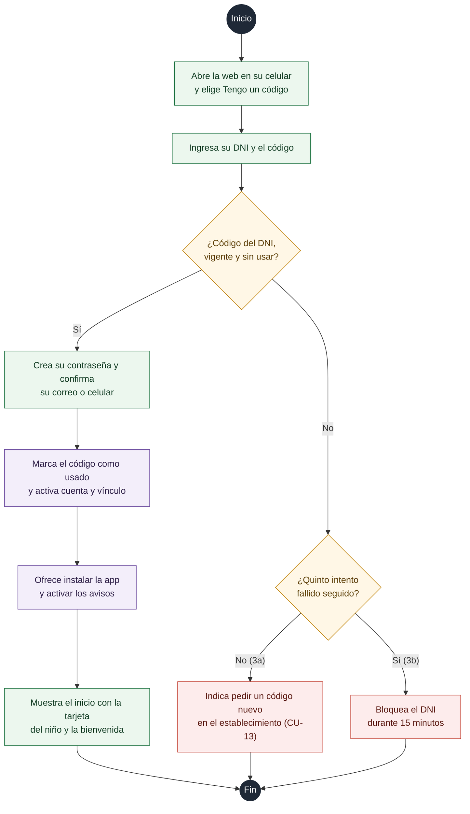

**Flujo principal**
1. El apoderado abre la web en su celular y elige "Tengo un código".
2. Ingresa su DNI y el código.
3. El sistema verifica que el código corresponde a ese DNI, que no venció y que no se usó.
4. El apoderado crea su contraseña y confirma su correo o celular.
5. El sistema marca el código como usado, activa el vínculo y ofrece instalar la app en la pantalla de inicio y activar los avisos.
6. Se muestra el inicio con la tarjeta del niño y una animación de bienvenida.

**Flujos alternativos**
- **3a.** Código vencido o ya usado: el sistema indica que pida uno nuevo en su establecimiento (CU-13).
- **3b.** Cinco intentos fallidos seguidos: el DNI queda bloqueado 15 minutos.

**Postcondiciones:** cuenta activa y vínculo activo.

#### CU-14 Registrar vacuna

| | |
|---|---|
| **Actor** | Digitador |
| **Objetivo** | Dejar constancia de una dosis aplicada. |
| **Precondiciones** | Sesión iniciada en un establecimiento; niño registrado. |

**Diagrama de actividad**

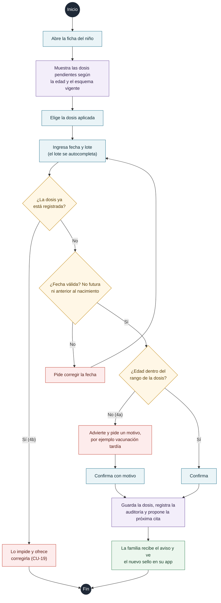

**Flujo principal**
1. El digitador abre la ficha del niño; el sistema muestra las dosis pendientes según su edad y el esquema vigente.
2. Elige la dosis aplicada (por ejemplo, "Neumococo, 2.ª dosis").
3. Ingresa fecha y lote. El lote se autocompleta con los últimos usados en el establecimiento.
4. El sistema valida que la dosis no esté registrada, que la fecha no sea futura ni anterior al nacimiento, y que la edad del niño esté dentro del rango de la dosis.
5. El digitador confirma. El sistema guarda la dosis y propone la próxima cita.
6. La familia recibe el aviso de novedad y en su app aparece el nuevo sello.

**Flujos alternativos**
- **4a.** La edad está fuera del rango recomendado: el sistema advierte y pide confirmar con un motivo (por ejemplo, vacunación tardía).
- **4b.** La dosis ya existe: el sistema lo impide y ofrece corregirla (CU-19).

**Postcondiciones:** dosis registrada a nombre del establecimiento y del digitador; evento en la auditoría.

#### CU-15 Registrar control CRED

| | |
|---|---|
| **Actor** | Digitador |
| **Objetivo** | Registrar las medidas del niño y su clasificación nutricional. |
| **Precondiciones** | Sesión iniciada en un establecimiento; niño registrado. |

**Diagrama de actividad**

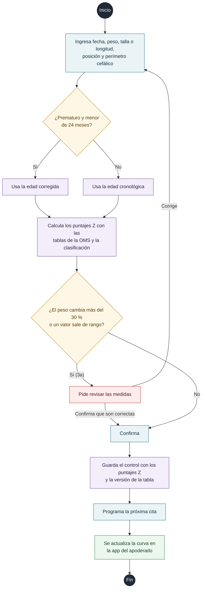

**Flujo principal**
1. El digitador ingresa fecha, peso, talla o longitud (indicando si se midió acostado o de pie) y perímetro cefálico.
2. El sistema calcula la edad (corregida si el niño fue prematuro y tiene menos de 24 meses).
3. El sistema calcula los puntajes Z con las tablas de la OMS y muestra la clasificación.
4. El digitador confirma y programa la próxima cita.

**Flujos alternativos**
- **3a.** El peso cambia más del 30 % respecto del control anterior, o el valor está fuera de rango biológico: el sistema pide revisar antes de guardar.

**Postcondiciones:** control guardado con los puntajes Z y la versión de la tabla usada; la curva del apoderado se actualiza.

#### CU-16 Registrar dosaje de hemoglobina

| | |
|---|---|
| **Actor** | Digitador |
| **Objetivo** | Registrar el resultado de hemoglobina y su clasificación de anemia. |
| **Precondiciones** | Sesión iniciada en un establecimiento con altitud registrada; niño registrado. |

**Diagrama de actividad**

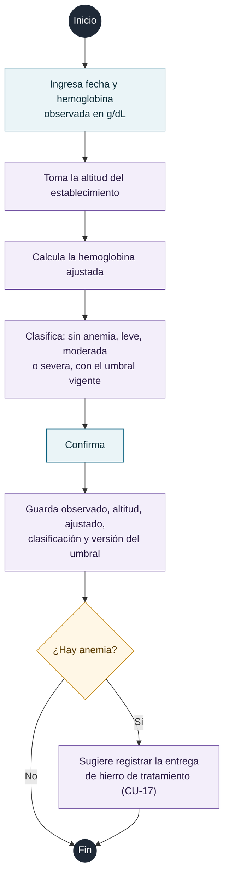

**Flujo principal**
1. El digitador ingresa fecha y valor observado (g/dL).
2. El sistema toma la altitud del establecimiento y calcula el valor ajustado.
3. El sistema clasifica (sin anemia, leve, moderada, severa) con los umbrales del catálogo vigente.
4. El digitador confirma. Si hay anemia, el sistema sugiere registrar la entrega de hierro de tratamiento (CU-17).

**Postcondiciones:** se guardan el valor observado, la altitud, el valor ajustado, la clasificación y la versión del umbral.

#### CU-19 Corregir registro

| | |
|---|---|
| **Actor** | Digitador (y Admin para aprobar) |
| **Objetivo** | Corregir un dato clínico mal registrado sin perder el original. |
| **Precondiciones** | El registro existe y está vigente. |

**Diagrama de actividad**

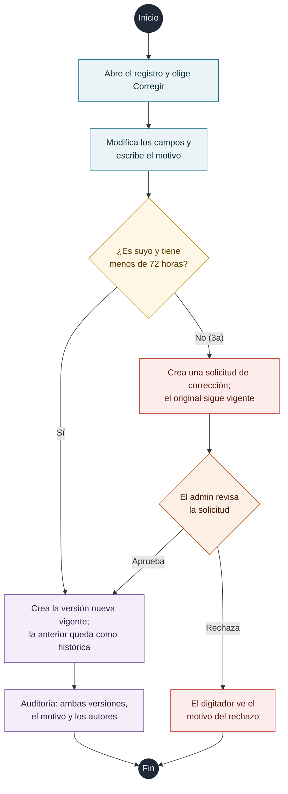

**Flujo principal**
1. El digitador abre el registro y elige "Corregir".
2. Modifica los campos y escribe el motivo (obligatorio).
3. Si el registro es suyo y tiene menos de 72 horas, el sistema crea una nueva versión vigente y la anterior queda como histórica.

**Flujos alternativos**
- **3a.** El registro tiene más de 72 horas o es de otro digitador: el sistema crea una **solicitud de corrección**. El registro original sigue vigente hasta que un admin la apruebe (CU-06). Si la rechaza, el digitador ve el motivo.

**Postcondiciones:** nada se borra; la auditoría guarda ambas versiones, el motivo y los autores.

#### CU-07 Revocar vínculo de apoderado

| | |
|---|---|
| **Actor** | Admin |
| **Objetivo** | Cortar el acceso de un apoderado a un niño (por ejemplo, por orden judicial). |
| **Precondiciones** | El vínculo está pendiente o activo. |

**Diagrama de actividad**

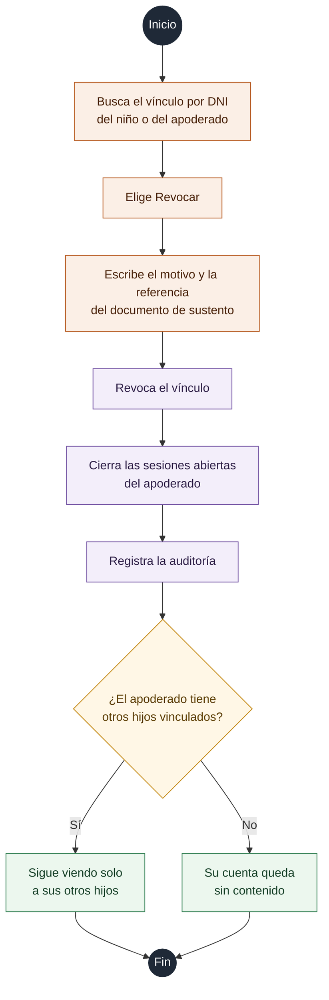

**Flujo principal**
1. El admin busca el vínculo por DNI del niño o del apoderado.
2. Elige "Revocar", escribe el motivo y la referencia del documento que lo sustenta.
3. El sistema revoca el vínculo y cierra las sesiones abiertas del apoderado.

**Postcondiciones:** el apoderado deja de ver al niño de inmediato. Si no tiene otros hijos vinculados, su cuenta queda sin contenido. Evento en la auditoría.

#### CU-23 Ver pasaporte de vacunas

| | |
|---|---|
| **Actor** | Usuario (apoderado) |
| **Objetivo** | Saber qué vacunas recibió su hijo y cuáles faltan. |
| **Precondiciones** | Sesión iniciada y vínculo activo con el niño. |

**Diagrama de actividad**

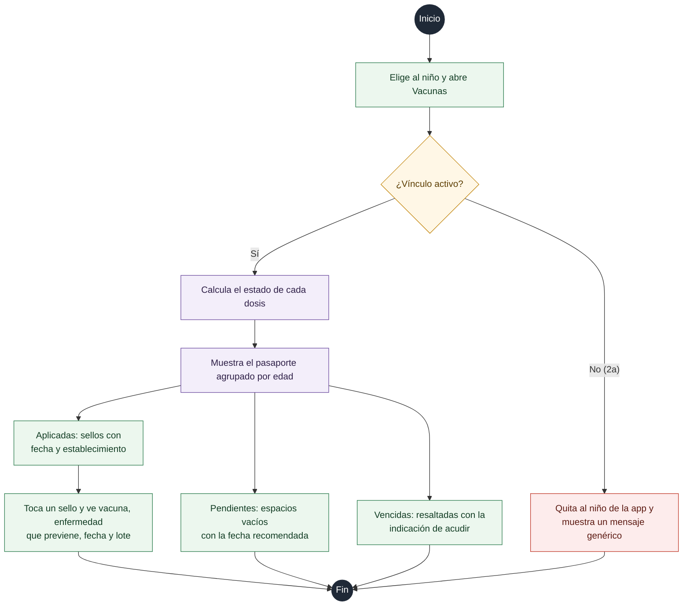

**Flujo principal**
1. El apoderado elige al niño y abre "Vacunas".
2. El sistema verifica que el vínculo esté activo.
3. Se muestra el pasaporte agrupado por edad: las dosis aplicadas como sellos con fecha y establecimiento; las pendientes como espacios vacíos con la fecha recomendada; las vencidas resaltadas con un texto que indica acudir al establecimiento.
4. Al tocar un sello se ve el detalle: vacuna, enfermedad que previene, fecha y lote.

**Flujos alternativos**
- **2a.** El vínculo fue revocado: el niño desaparece de la app y se muestra un mensaje genérico.

#### CU-40 Recordar cita

| | |
|---|---|
| **Actor** | Sistema (reloj) |
| **Objetivo** | Que la familia no olvide la cita. |
| **Precondiciones** | La cita está programada y el apoderado tiene vínculo activo y avisos activados. |

**Diagrama de actividad**

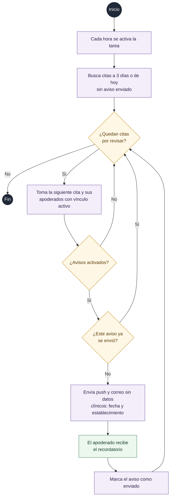

**Flujo principal**
1. Cada hora, el sistema busca citas que estén a 3 días o que sean hoy y aún no tengan aviso enviado.
2. Para cada apoderado vinculado con avisos activos, encola un mensaje.
3. El mensaje sale por push y por correo. El texto no incluye datos clínicos: "Tienes una cita de control el 12 de octubre en el CAP III Puente Piedra".
4. El sistema marca el aviso como enviado para no repetirlo.

#### CU-09 Ver reportes y tableros

| | |
|---|---|
| **Actor** | Admin |
| **Objetivo** | Ver la situación de la población atendida por establecimiento y red asistencial. |
| **Precondiciones** | Sesión iniciada como admin. |

**Diagrama de actividad**

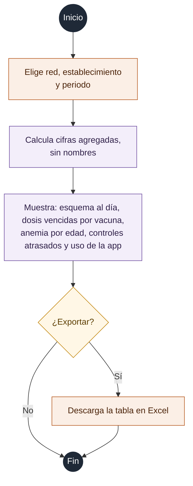

**Flujo principal**
1. El admin elige red, establecimiento y periodo.
2. El sistema muestra: niños con esquema al día, dosis vencidas por vacuna, prevalencia de anemia por edad, niños con controles atrasados y porcentaje de apoderados que usan la app.
3. El admin puede exportar la tabla a Excel. Los reportes muestran cifras agregadas, sin nombres.

### 9.4 Estados

#### 9.4.1 Vínculo entre apoderado y niño

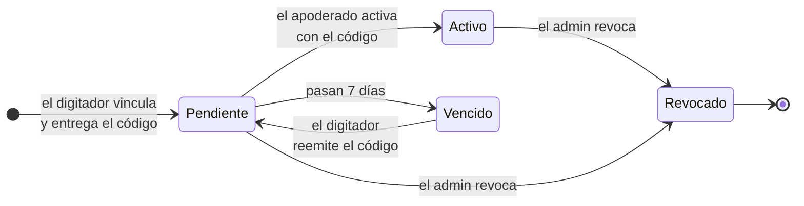

#### 9.4.2 Dosis de una vacuna para un niño

Este estado no se guarda: el sistema lo calcula con la fecha de nacimiento y el esquema vigente.

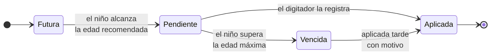

#### 9.4.3 Solicitud de corrección

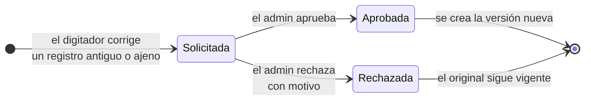

### 9.5 Diagrama de clases

#### 9.5.1 Modelo de dominio

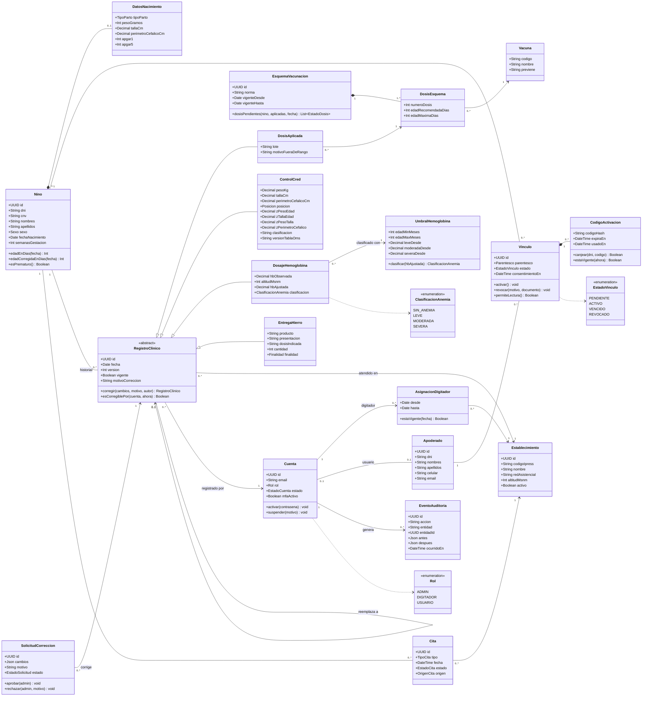

#### 9.5.2 Módulos del backend

Cada módulo expone una interfaz pública y no lee las tablas de los otros. Las reglas clínicas viven en el paquete puro `clinical`, que usan la API, la web y el PDF.

```mermaid
classDiagram
    direction TB

    class IdentityModule {
        +iniciarSesion(email, contrasena, codigoMfa)
        +activarConCodigo(dni, codigo, contrasena)
        +cuentaActual()
    }
    class FacilitiesModule {
        +establecimientosDe(digitador)
        +altitudDe(establecimiento)
    }
    class ChildrenModule {
        +buscarPorDocumento(dniOCnv)
        +registrarNino(datos)
        +vincularApoderado(nino, apoderado, consentimiento)
        +revocarVinculo(vinculo, motivo)
        +tieneVinculoActivo(cuenta, nino)
    }
    class CatalogsModule {
        +esquemaVigenteEn(fecha)
        +umbralHemoglobina(edadMeses, fecha)
        +intervaloCita(tipo, edadMeses)
    }
    class ImmunizationModule {
        +registrarDosis(nino, dosis)
        +estadoEsquema(nino, fecha)
    }
    class GrowthModule {
        +registrarControl(nino, medidas)
        +curvas(nino)
    }
    class AnemiaModule {
        +registrarDosaje(nino, hb)
        +registrarEntregaHierro(nino, entrega)
    }
    class ScheduleModule {
        +programarCita(nino, tipo, fecha)
        +proponerCita(nino, tipo)
        +citasPorAvisar(ahora)
    }
    class NotificationsModule {
        +encolar(destinatario, plantilla)
    }
    class ReportsModule {
        +carnetPdf(nino)
        +tablero(red, establecimiento, periodo)
    }
    class AuditModule {
        +registrar(evento)
    }
    class ClinicalPackage {
        <<paquete puro>>
        +puntajeZ(indicador, sexo, edadDias, valor)
        +ajustarHemoglobina(hb, altitud)
        +estadoDosis(esquema, nacimiento, aplicadas, fecha)
        +edadCorregida(nacimiento, semanas, fecha)
    }

    ImmunizationModule ..> CatalogsModule
    ImmunizationModule ..> ChildrenModule
    ImmunizationModule ..> ClinicalPackage
    GrowthModule ..> ChildrenModule
    GrowthModule ..> ClinicalPackage
    AnemiaModule ..> CatalogsModule
    AnemiaModule ..> FacilitiesModule
    AnemiaModule ..> ClinicalPackage
    ScheduleModule ..> CatalogsModule
    ScheduleModule ..> NotificationsModule
    ReportsModule ..> ImmunizationModule
    ReportsModule ..> GrowthModule
    ReportsModule ..> AnemiaModule
    ChildrenModule ..> NotificationsModule
    ChildrenModule ..> AuditModule
    ImmunizationModule ..> AuditModule
    GrowthModule ..> AuditModule
    AnemiaModule ..> AuditModule
    IdentityModule ..> ChildrenModule
```

### 9.6 Diagrama entidad-relación

#### 9.6.1 Vista general

```mermaid
erDiagram
    CUENTA ||--o{ ASIGNACION_DIGITADOR : "trabaja en"
    ESTABLECIMIENTO ||--o{ ASIGNACION_DIGITADOR : "tiene"
    CUENTA |o--o| APODERADO : "es"
    NINO ||--o| DATOS_NACIMIENTO : "nace con"
    NINO ||--o{ VINCULO : "tiene"
    APODERADO ||--o{ VINCULO : "tiene"
    VINCULO ||--o{ CODIGO_ACTIVACION : "genera"
    ESQUEMA_VACUNACION ||--|{ DOSIS_ESQUEMA : "define"
    VACUNA ||--o{ DOSIS_ESQUEMA : "aparece en"
    NINO ||--o{ DOSIS_APLICADA : "recibe"
    DOSIS_ESQUEMA ||--o{ DOSIS_APLICADA : "corresponde a"
    NINO ||--o{ CONTROL_CRED : "tiene"
    NINO ||--o{ DOSAJE_HEMOGLOBINA : "tiene"
    UMBRAL_HEMOGLOBINA ||--o{ DOSAJE_HEMOGLOBINA : "clasifica"
    NINO ||--o{ ENTREGA_HIERRO : "recibe"
    NINO ||--o{ CITA : "tiene"
    ESTABLECIMIENTO ||--o{ CITA : "atiende"
    CUENTA ||--o{ SOLICITUD_CORRECCION : "pide"
    CUENTA ||--o{ NOTIFICACION : "recibe"
    CUENTA ||--o{ SUSCRIPCION_PUSH : "registra"
    CUENTA ||--o{ EVENTO_AUDITORIA : "genera"
```

#### 9.6.2 Personas y accesos

```mermaid
erDiagram
    CUENTA {
        uuid id PK
        string email UK
        string password_hash
        string rol "ADMIN, DIGITADOR o USUARIO"
        string estado "ACTIVA, SUSPENDIDA"
        string mfa_secreto_cifrado "obligatorio en admin y digitador"
        int intentos_fallidos
        timestamp bloqueada_hasta
        timestamp creada_en
    }
    ESTABLECIMIENTO {
        uuid id PK
        string codigo_ipress UK
        string nombre
        string red_asistencial
        int altitud_msnm "para ajustar hemoglobina"
        boolean activo
    }
    ASIGNACION_DIGITADOR {
        uuid id PK
        uuid cuenta_id FK
        uuid establecimiento_id FK
        date desde
        date hasta "nulo si sigue vigente"
    }
    NINO {
        uuid id PK
        string dni UK "nulo hasta obtenerlo"
        string cnv UK
        string nombres
        string apellidos
        string sexo
        date fecha_nacimiento
        int semanas_gestacion "para edad corregida"
        string grupo_sanguineo
        timestamp creado_en
        uuid creado_por FK
    }
    DATOS_NACIMIENTO {
        uuid nino_id PK, FK
        string lugar_nacimiento
        string tipo_parto "VAGINAL o CESAREA"
        int peso_gramos
        decimal talla_cm
        decimal perimetro_cefalico_cm
        int apgar_1
        int apgar_5
    }
    APODERADO {
        uuid id PK
        string dni UK
        string nombres
        string apellidos
        string celular
        string email
        uuid cuenta_id FK "nulo hasta activar"
    }
    VINCULO {
        uuid id PK
        uuid nino_id FK
        uuid apoderado_id FK
        string parentesco
        string estado "PENDIENTE, ACTIVO, VENCIDO, REVOCADO"
        timestamp consentimiento_en
        uuid creado_por FK
        uuid revocado_por FK
        timestamp revocado_en
        string motivo_revocacion
        string documento_sustento
    }
    CODIGO_ACTIVACION {
        uuid id PK
        uuid vinculo_id FK
        string codigo_hash "nunca en texto plano"
        timestamp expira_en
        timestamp usado_en
    }
    FOTO_NINO {
        uuid id PK
        uuid cuenta_id FK "solo la ve quien la subió"
        uuid nino_id FK
        string ruta
    }

    CUENTA ||--o{ ASIGNACION_DIGITADOR : "trabaja en"
    ESTABLECIMIENTO ||--o{ ASIGNACION_DIGITADOR : "tiene"
    CUENTA |o--o| APODERADO : "es"
    NINO ||--o| DATOS_NACIMIENTO : "nace con"
    NINO ||--o{ VINCULO : "tiene"
    APODERADO ||--o{ VINCULO : "tiene"
    VINCULO ||--o{ CODIGO_ACTIVACION : "genera"
    CUENTA ||--o{ FOTO_NINO : "sube"
    NINO ||--o{ FOTO_NINO : "aparece en"
```

#### 9.6.3 Registros clínicos y catálogos

Todos los registros clínicos comparten estas columnas: `establecimiento_id`, `registrado_por`, `registrado_en`, `version`, `vigente`, `reemplaza_id` (la versión anterior) y `motivo_correccion`. Se muestran completas solo en `DOSIS_APLICADA` para no repetirlas.

```mermaid
erDiagram
    ESQUEMA_VACUNACION {
        uuid id PK
        string norma "norma técnica de origen"
        date vigente_desde
        date vigente_hasta
    }
    VACUNA {
        uuid id PK
        string codigo UK
        string nombre
        string previene
    }
    DOSIS_ESQUEMA {
        uuid id PK
        uuid esquema_id FK
        uuid vacuna_id FK
        int numero_dosis
        int edad_recomendada_dias
        int edad_maxima_dias
    }
    DOSIS_APLICADA {
        uuid id PK
        uuid nino_id FK
        uuid dosis_esquema_id FK
        date fecha
        string lote
        string motivo_fuera_de_rango
        uuid establecimiento_id FK
        uuid registrado_por FK
        timestamp registrado_en
        int version
        boolean vigente
        uuid reemplaza_id FK
        string motivo_correccion
    }
    CONTROL_CRED {
        uuid id PK
        uuid nino_id FK
        date fecha
        decimal peso_kg
        decimal talla_cm
        string posicion "ACOSTADO o DE_PIE"
        decimal perimetro_cefalico_cm
        decimal z_peso_edad
        decimal z_talla_edad
        decimal z_peso_talla
        decimal z_perimetro_cefalico
        string clasificacion
        string version_tabla_oms
    }
    UMBRAL_HEMOGLOBINA {
        uuid id PK
        string norma
        int edad_min_meses
        int edad_max_meses
        decimal leve_desde
        decimal moderada_desde
        decimal severa_desde
        date vigente_desde
    }
    DOSAJE_HEMOGLOBINA {
        uuid id PK
        uuid nino_id FK
        date fecha
        decimal hb_observada
        int altitud_msnm
        decimal hb_ajustada
        string clasificacion
        uuid umbral_id FK
    }
    ENTREGA_HIERRO {
        uuid id PK
        uuid nino_id FK
        date fecha
        string producto
        string presentacion
        string dosis_indicada
        int cantidad
        string finalidad "PREVENTIVA o TRATAMIENTO"
    }
    NINO {
        uuid id PK
    }

    ESQUEMA_VACUNACION ||--|{ DOSIS_ESQUEMA : "define"
    VACUNA ||--o{ DOSIS_ESQUEMA : "aparece en"
    DOSIS_ESQUEMA ||--o{ DOSIS_APLICADA : "corresponde a"
    NINO ||--o{ DOSIS_APLICADA : "recibe"
    DOSIS_APLICADA |o--o| DOSIS_APLICADA : "reemplaza a"
    NINO ||--o{ CONTROL_CRED : "tiene"
    NINO ||--o{ DOSAJE_HEMOGLOBINA : "tiene"
    UMBRAL_HEMOGLOBINA ||--o{ DOSAJE_HEMOGLOBINA : "clasifica"
    NINO ||--o{ ENTREGA_HIERRO : "recibe"
```

**Unicidad garantizada por la base:** una sola versión vigente por niño y `dosis_esquema_id` (índice único parcial sobre `vigente = true`).

#### 9.6.4 Citas, avisos, correcciones y auditoría

```mermaid
erDiagram
    CITA {
        uuid id PK
        uuid nino_id FK
        uuid establecimiento_id FK
        string tipo "CRED, VACUNA o DOSAJE"
        timestamp fecha
        string estado "PROGRAMADA, ATENDIDA, PERDIDA"
        string origen "DIGITADOR o SISTEMA"
        timestamp aviso_previo_en
        timestamp aviso_dia_en
    }
    NOTIFICACION {
        uuid id PK
        uuid cuenta_id FK
        string tipo
        string canal "PUSH o CORREO"
        string estado "EN_COLA, ENVIADA, FALLIDA"
        string clave_idempotencia UK
        timestamp programada_en
        timestamp enviada_en
    }
    SUSCRIPCION_PUSH {
        uuid id PK
        uuid cuenta_id FK
        string endpoint UK
        string clave_p256dh
        string clave_auth
    }
    PREFERENCIA_AVISOS {
        uuid cuenta_id PK, FK
        boolean push
        boolean correo
    }
    SOLICITUD_CORRECCION {
        uuid id PK
        string tipo_registro
        uuid registro_id
        json cambios
        string motivo
        string estado "SOLICITADA, APROBADA, RECHAZADA"
        uuid solicitado_por FK
        uuid resuelto_por FK
        timestamp resuelto_en
        string motivo_rechazo
    }
    EVENTO_AUDITORIA {
        bigint id PK
        uuid cuenta_id FK
        string accion "incluye las lecturas del carnet"
        string entidad
        uuid entidad_id
        json antes
        json despues
        string ip
        timestamp ocurrido_en
    }
    CUENTA {
        uuid id PK
    }
    NINO {
        uuid id PK
    }

    NINO ||--o{ CITA : "tiene"
    CUENTA ||--o{ NOTIFICACION : "recibe"
    CUENTA ||--o{ SUSCRIPCION_PUSH : "registra"
    CUENTA ||--o| PREFERENCIA_AVISOS : "configura"
    CUENTA ||--o{ SOLICITUD_CORRECCION : "pide o resuelve"
    CUENTA ||--o{ EVENTO_AUDITORIA : "genera"
```

`EVENTO_AUDITORIA` solo admite inserciones: el usuario de base de datos de la API no tiene permiso de `UPDATE` ni `DELETE` sobre esa tabla.

### 9.7 Diagramas de secuencia

#### 9.7.1 Vincular apoderado y activar su cuenta

```mermaid
sequenceDiagram
    autonumber
    actor DIG as Digitador
    actor USR as Apoderado
    participant WEB as Web (Next.js)
    participant API as API (NestJS)
    participant DB as PostgreSQL
    participant Q as Cola (Redis)
    participant WRK as Worker

    rect rgba(31, 111, 139, 0.08)
    note over DIG, WRK: En el establecimiento
    DIG->>WEB: Vincular apoderado (DNI, parentesco, consentimiento)
    WEB->>API: POST /ninos/{id}/vinculos
    API->>API: Verifica rol digitador y asignación vigente
    API->>DB: Busca apoderado por DNI
    alt El apoderado no existe
        API->>DB: Crea apoderado
    end
    API->>DB: Crea vínculo PENDIENTE y código (hash, expira en 7 días)
    API->>DB: Evento de auditoría vinculo.creado
    API->>Q: Encola correo con el código
    API-->>WEB: Código en claro (solo esta vez)
    WEB-->>DIG: Muestra e imprime el código
    Q-->>WRK: Toma el trabajo
    WRK-->>USR: Correo con el código
    end

    rect rgba(46, 125, 79, 0.08)
    note over USR, DB: En el celular del apoderado
    USR->>WEB: Tengo un código (DNI y código)
    WEB->>API: POST /activacion
    API->>DB: Busca código vigente del DNI
    alt Código válido
        USR->>WEB: Crea contraseña
        WEB->>API: POST /activacion/confirmar
        API->>DB: Crea cuenta, marca código usado, vínculo ACTIVO
        API-->>WEB: Cookie de sesión httpOnly
        WEB-->>USR: Bienvenida y tarjeta del niño
    else Vencido, usado o incorrecto
        API->>DB: Suma intento fallido
        API-->>WEB: Error genérico
        WEB-->>USR: Pide un código nuevo en el establecimiento
    end
    end
```

#### 9.7.2 Registrar una vacuna y avisar a la familia

```mermaid
sequenceDiagram
    autonumber
    actor DIG as Digitador
    participant WEB as Web (Next.js)
    participant API as API (NestJS)
    participant CLI as Paquete clinical
    participant DB as PostgreSQL
    participant Q as Cola (Redis)
    participant WRK as Worker
    actor USR as Apoderado

    DIG->>WEB: Abre la ficha del niño
    WEB->>API: GET /ninos/{id}/vacunas
    API->>DB: Esquema vigente y dosis aplicadas
    API->>CLI: estadoDosis(esquema, nacimiento, aplicadas, hoy)
    CLI-->>API: Pendientes, vencidas y futuras
    API-->>WEB: Lista de dosis
    DIG->>WEB: Registra Neumococo 2.ª dosis, fecha y lote
    WEB->>API: POST /ninos/{id}/dosis
    API->>CLI: Valida edad contra el rango de la dosis
    alt Fuera del rango recomendado
        API-->>WEB: Pide confirmar con motivo
        DIG->>WEB: Confirma con motivo
        WEB->>API: POST /ninos/{id}/dosis (con motivo)
    end
    API->>DB: Transacción: dosis + auditoría + aviso pendiente
    API-->>WEB: Dosis guardada y cita propuesta
    WEB-->>DIG: Confirma y ofrece programar la cita
    Q-->>WRK: Aviso de novedad
    WRK->>DB: Apoderados con vínculo activo y avisos activos
    WRK-->>USR: Push "Hay una novedad en el carnet"
    USR->>WEB: Abre la app
    WEB-->>USR: Animación del nuevo sello en el pasaporte
```

#### 9.7.3 El apoderado consulta el carnet

```mermaid
sequenceDiagram
    autonumber
    actor USR as Apoderado
    participant WEB as Web (PWA)
    participant API as API (NestJS)
    participant DB as PostgreSQL

    USR->>WEB: Abre el pasaporte de vacunas de su hijo
    WEB->>API: GET /mis-ninos/{id}/carnet (cookie de sesión)
    API->>API: Valida sesión y rol USUARIO
    API->>DB: Consulta con filtro por vínculo ACTIVO de esta cuenta
    alt Tiene vínculo activo
        DB-->>API: Dosis, controles, hemoglobina, citas
        API->>DB: Auditoría carnet.leido
        API-->>WEB: Carnet con estados calculados
        WEB-->>USR: Sellos, curvas animadas y próximo paso
    else Sin vínculo o revocado
        DB-->>API: Sin filas
        API-->>WEB: 404 (no revela si el niño existe)
        WEB-->>USR: Quita al niño de la lista
    end
```

#### 9.7.4 Corregir un registro

```mermaid
sequenceDiagram
    autonumber
    actor DIG as Digitador
    actor ADM as Admin
    participant API as API (NestJS)
    participant DB as PostgreSQL

    DIG->>API: Corrige control CRED (cambios y motivo)
    API->>DB: Lee registro vigente
    alt Es suyo y tiene menos de 72 horas
        API->>DB: Transacción: versión anterior vigente=false, nueva versión vigente=true, auditoría
        API-->>DIG: Corrección aplicada
    else Más de 72 horas o registro ajeno
        API->>DB: Crea solicitud SOLICITADA
        API-->>DIG: Corrección enviada a aprobación
        ADM->>API: Revisa la solicitud
        alt Aprueba
            API->>DB: Transacción: nueva versión, solicitud APROBADA, auditoría
            API-->>ADM: Aprobada
        else Rechaza con motivo
            API->>DB: Solicitud RECHAZADA, auditoría
            API-->>ADM: Rechazada
        end
    end
```

#### 9.7.5 Recordatorio de cita

```mermaid
sequenceDiagram
    autonumber
    participant CRON as Reloj (BullMQ)
    participant WRK as Worker
    participant DB as PostgreSQL
    participant PUSH as Servicio Web Push
    participant SMTP as Servidor de correo
    actor USR as Apoderado

    CRON->>WRK: Cada hora: revisar citas
    WRK->>DB: Citas a 3 días o de hoy sin aviso enviado
    loop Por cada cita y apoderado con vínculo activo
        WRK->>DB: Inserta notificación con clave de idempotencia
        alt La clave ya existía
            WRK->>WRK: Omite (ya se avisó)
        else Nueva
            par Push
                WRK->>PUSH: Mensaje sin datos clínicos
                PUSH-->>USR: Notificación en el celular
            and Correo
                WRK->>SMTP: Correo con fecha y establecimiento
                SMTP-->>USR: Correo
            end
            WRK->>DB: Marca aviso enviado
        end
    end
```

#### 9.7.6 Descargar el carnet en PDF

```mermaid
sequenceDiagram
    autonumber
    actor USR as Apoderado
    participant WEB as Web (PWA)
    participant API as API (NestJS)
    participant Q as Cola (Redis)
    participant WRK as Worker (Chromium)

    USR->>WEB: Descargar carnet
    WEB->>API: POST /mis-ninos/{id}/pdf
    API->>API: Verifica vínculo activo
    API->>Q: Encola generación
    API-->>WEB: Trabajo en curso
    Q-->>WRK: Toma el trabajo
    WRK->>WRK: Renderiza plantilla HTML e imprime a PDF
    WRK-->>Q: PDF listo (en memoria, expira en 5 minutos)
    WEB->>API: Consulta el estado
    API-->>WEB: PDF
    WEB-->>USR: Descarga el archivo
```

### 9.8 Diagrama de despliegue

```mermaid
flowchart TB
    subgraph CLIENTES["Dispositivos"]
        direction LR
        CEL["Celular del apoderado<br/>PWA instalada"]:::cliente
        PCD["PC del digitador<br/>navegador"]:::cliente
        PCA["PC del admin<br/>navegador"]:::cliente
    end

    CF["Cloudflare<br/>DNS, CDN, WAF<br/>SSL modo Full"]:::borde

    subgraph VPS["Servidor VPS (Linux)"]
        NGX["nginx del host<br/>TLS propio, puerto 443"]:::infra

        subgraph DOCKER["Docker Compose: red interna"]
            direction TB
            WEB["web<br/>Next.js 16<br/>127.0.0.1:puerto"]:::app
            API["api<br/>NestJS 12 + Fastify"]:::app
            WRK["worker<br/>BullMQ + Chromium"]:::app
            PG[("postgres<br/>PostgreSQL 16")]:::datos
            RD[("redis<br/>colas y límites")]:::datos
            VOL[["volumen cifrado<br/>datos y fotos"]]:::datos
        end

        BKP["cron de respaldo<br/>pg_dump cifrado diario"]:::infra
    end

    subgraph EXT["Servicios externos"]
        direction LR
        SMTP["Servidor de correo<br/>SMTP"]:::externo
        WPUSH["Servicios Web Push<br/>Google, Apple, Mozilla"]:::externo
        OFF["Almacenamiento<br/>de respaldos fuera del VPS"]:::externo
    end

    GHA["GitHub Actions<br/>lint, pruebas, build de imágenes"]:::externo

    CEL -->|"HTTPS"| CF
    PCD -->|"HTTPS"| CF
    PCA -->|"HTTPS"| CF
    CF -->|"HTTPS 443"| NGX
    NGX -->|"HTTP local"| WEB
    WEB -->|"HTTP red interna"| API
    API -->|"TCP 5432"| PG
    API -->|"TCP 6379"| RD
    WRK -->|"TCP 6379"| RD
    WRK -->|"TCP 5432"| PG
    PG --- VOL
    API --- VOL
    WRK -->|"SMTP TLS"| SMTP
    WRK -->|"HTTPS VAPID"| WPUSH
    BKP -->|"lee"| PG
    BKP -->|"copia cifrada"| OFF
    GHA -.->|"despliegue"| VPS

    classDef cliente fill:#ECF7EE,stroke:#2E7D4F,color:#123D24
    classDef borde fill:#FFF7E6,stroke:#C2850C,color:#5C3D00
    classDef infra fill:#F4F4F5,stroke:#6B7280,color:#111827
    classDef app fill:#EAF4F7,stroke:#1F6F8B,color:#0F2F3A,font-weight:bold
    classDef datos fill:#F3EEFA,stroke:#6D4C9F,color:#2E1F47
    classDef externo fill:#FFFFFF,stroke:#9CA3AF,color:#374151,stroke-dasharray:4 3
```

**Notas de despliegue**
- Solo el contenedor `web` publica un puerto, y solo en `127.0.0.1`. La API, la base y Redis no son accesibles desde fuera del servidor.
- El navegador nunca habla con la API: todo pasa por `web`, que guarda la sesión en una cookie `httpOnly`.
- Los avisos push y los correos no llevan datos clínicos, solo el aviso de que hay una novedad o una cita.
- Los respaldos salen cifrados del servidor todos los días.

---

## 10. Plan de trabajo

| Etapa | Contenido |
|---|---|
| 0 | README cerrado, modelo de datos y diseño de pantallas |
| 1 | Monorepo, identidad, roles, establecimientos y catálogos |
| 2 | Niño, apoderados, vínculo y activación; área del digitador |
| 3 | Vacunación, crecimiento y anemia en el área del digitador |
| 4 | Área del usuario: inicio, línea de tiempo, pasaporte, curvas y próximo paso |
| 5 | Citas, recordatorios, notificaciones y PDF |
| 6 | Despliegue y piloto con datos ficticios |

---

## 11. Después del MVP

- Evaluación del desarrollo y contenido por edad (hitos, consejos, actividades).
- Salud bucal, vitamina A, desparasitación y tamizajes.
- Integración con ESSI para no registrar dos veces.
- Tableros por establecimiento y red asistencial.
- App nativa si la PWA se queda corta.

